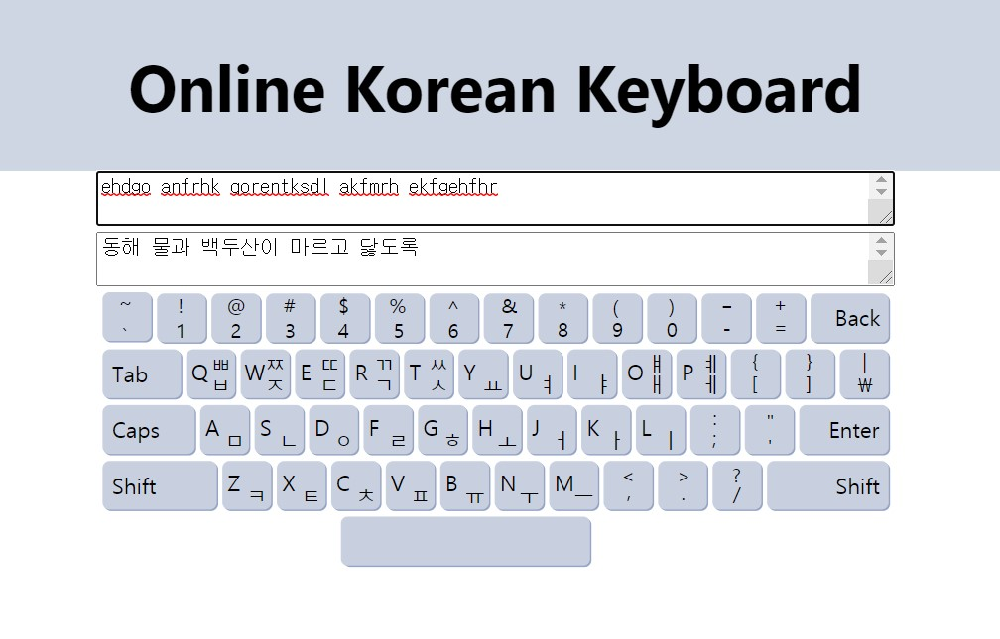

# Online Keyboard

Type in Korean without installing a Korean keyboard!

## How it works
1. Parse into Korean characters using Dubeolsik keyboard layout.  
   dkssud -> ㅇㅏㄴㄴㅕㅇ
2. Combine initial, medial and final jamo.  
   ㅇㅏㄴㄴㅕㅇ -> 안녕

## More features to come...
* ~~Auto-highlight keys on hover~~: *Done*
* Click keys to type: *In progress*
* Support romanization to Korean parsing

## References
1. https://web.archive.org/web/20190512031142/http://www.programminginkorean.com/programming/hangul-in-unicode/composing-syllables-in-unicode/
2. http://gernot-katzers-spice-pages.com/var/korean_hangul_unicode.html
